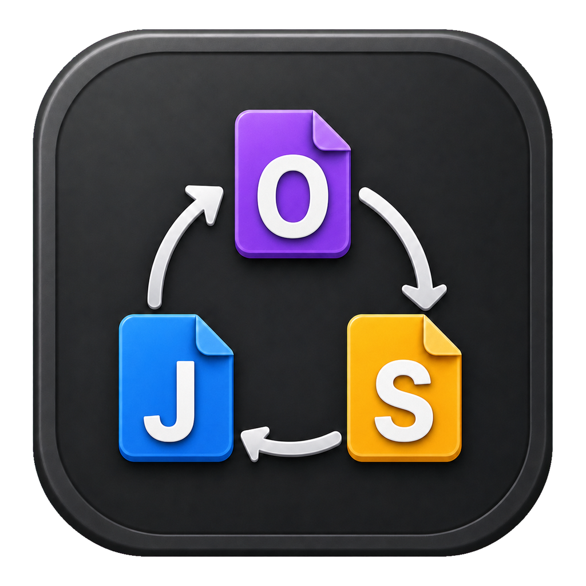
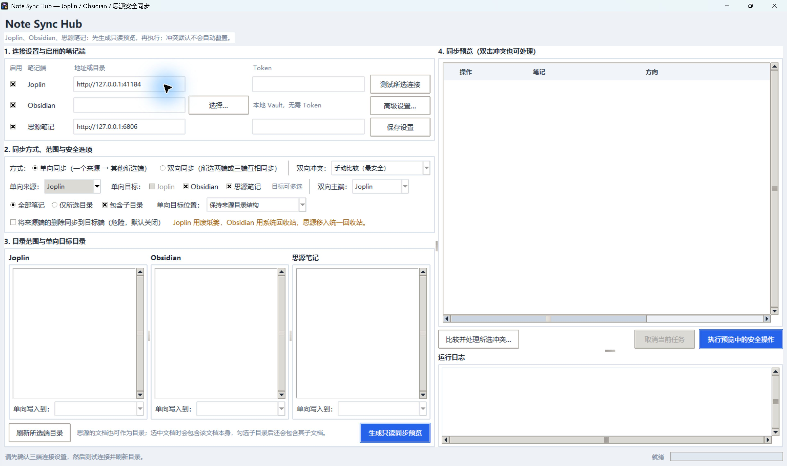
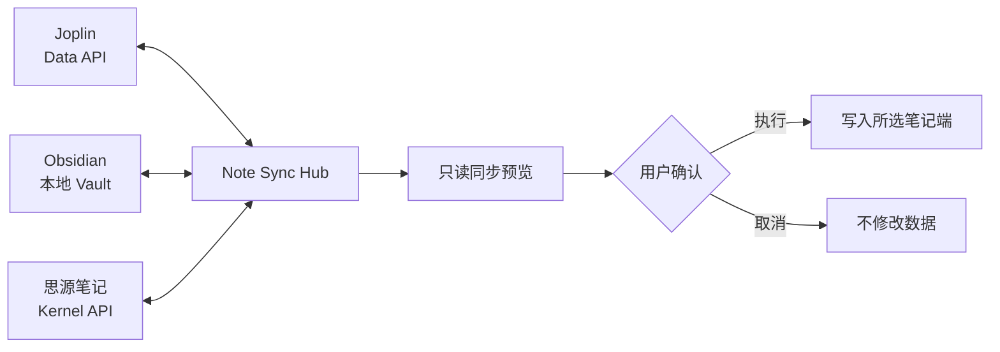

<div align="center">
  
  <h1>Note Sync Hub</h1>
  <p>在 Joplin、Obsidian 与思源笔记之间安全同步 Markdown 笔记。</p>
  <p><strong>简体中文</strong> · <a href="README_EN.md">English</a></p>
  <p>
    <a href="https://github.com/xing-skyline/note-sync-hub/releases/latest"></a>
    
    
    <a href="LICENSE"></a>
  </p>
  <p>
    <a href="https://github.com/xing-skyline/note-sync-hub/releases/latest"><strong>下载 Windows 版</strong></a>
  </p>
</div>



## 这是什么

Note Sync Hub 是一个本地运行的 Windows 桌面工具。你可以选择任意两个或三个笔记端，在写入前查看完整预览，再决定是否执行同步。

它适合这些场景：

- 把 Joplin 笔记迁移或备份到 Obsidian。
- 在 Obsidian 与思源笔记之间保留一份可读的 Markdown 副本。
- 让 Joplin、Obsidian、思源笔记共享同一批 Markdown 笔记、标签和附件。
- 在正式迁移前检查目录映射、冲突和删除影响。

程序没有云端服务、账号系统或遥测。Joplin 与思源通过你填写的 API 地址连接，Obsidian 直接读写本地 Vault。

> [!WARNING]
> 当前版本仍处于早期阶段。第一次使用前请备份笔记库，并先用少量测试笔记验证目录、附件和平台专属语法的转换结果。

## 功能

| 能力 | 说明 |
| --- | --- |
| 两端或三端同步 | 任意启用 Joplin、Obsidian、思源笔记中的两个或三个端 |
| 单向同步 | 选择一个来源端和一个或两个目标端 |
| 双向同步 | 所选端都可新增或修改，并明确指定主端处理删除方向 |
| 只读预览 | 写入前列出新建、更新、移动、删除、关联、跳过和冲突 |
| 冲突处理 | 手动逐块比较 Markdown；Joplin 与 Obsidian 还可按唯一最新时间生成预览 |
| 目录映射 | 保持来源结构、写入指定目标目录，或写入目标根目录 |
| 标签与附件 | 同步标签，并转换 Joplin Resource、Obsidian 附件和思源 `assets` 链接 |
| 安全删除 | 删除同步默认关闭；开启后使用各端废纸篓、Windows 回收站或思源托管回收站 |
| 过期预览保护 | 执行前重新扫描；笔记或附件变化后自动停止，要求重新预览 |
| 可取消执行 | 在当前单条笔记处理完成后停止后续操作 |

## 工作方式



Note Sync Hub 会在笔记中加入同步标记，用于识别同一条笔记在不同应用中的副本。状态文件只保存配对所需的信息；程序不会建立第四份完整笔记库。

## 快速开始

### 1. 下载

打开 [Releases](https://github.com/xing-skyline/note-sync-hub/releases/latest)，下载：

```text
NoteSyncHub-v1.2.0-windows-x64.exe
```

程序为单文件 EXE，无需安装。建议同时下载 `SHA256SUMS.txt` 并核对文件哈希。

当前 EXE 没有商业代码签名证书，Windows 可能显示“未知发布者”。请只从本仓库的 Releases 下载；如果你不接受未签名程序，可按下文说明从源码运行。

### 2. 准备笔记端

#### Joplin

1. 打开 Joplin 桌面版。
2. 进入“工具 → 选项 → Web Clipper”。
3. 启用 Web Clipper 服务，复制端口和 Authorization Token。
4. 默认地址通常是 `http://127.0.0.1:41184`。

参考：[Joplin Web Clipper](https://joplinapp.org/help/apps/clipper/) · [Joplin Data API](https://joplinapp.org/help/api/references/rest_api/)

#### Obsidian

选择 Vault 根目录即可，不需要安装 Obsidian 插件。程序默认排除 `.obsidian`、`.trash`、`assets`、`attachments` 和 Obsidian 当前设置的附件目录。

#### 思源笔记

1. 启动思源桌面版并打开工作空间。
2. 进入“设置 → 关于”，复制 API Token。
3. 本机默认地址是 `http://127.0.0.1:6806`。

参考：[思源 Kernel API](https://github.com/siyuan-note/siyuan/blob/master/API.md)

### 3. 预览并同步

1. 启用需要参与同步的笔记端，填写地址、Vault 和 Token。
2. 点击“测试所选连接”。
3. 点击“刷新所选端目录”。
4. 选择单向或双向同步、同步范围、目标目录和冲突策略。
5. 点击“生成只读同步预览”。
6. 检查操作列表并处理红色冲突项。
7. 点击“执行预览中的安全操作”。

生成预览不会修改任何笔记。执行前程序会重新扫描；只要数据发生变化，本次执行就会停止。

## 同步规则

### 单向同步

你需要指定一个来源端，再选择一个或两个目标端。目标位置支持三种方式：

| 方式 | 示例结果 |
| --- | --- |
| 保持来源目录结构 | `工作/A/子目录/会议记录` |
| 放入指定目标目录 | `归档/B/A/子目录/会议记录` |
| 放入目标根目录 | `A/子目录/会议记录` |

### 双向与三端同步

所选端都可以新增或修改笔记。主端用于确定删除传播方向和冲突的默认参考位置，不是固定写入来源。

- 只有一个端发生变化时，程序把该版本传播到其他所选端。
- 多个端分别修改同一条笔记时，程序标记冲突。
- 仅 Joplin 与 Obsidian 双向同步支持“按最后修改时间自动选择唯一最新版本”。
- 自动选择只生成预览，不会跳过用户确认直接写入。

### 删除

“将来源端/双向主端的删除同步到其他端”默认关闭。

- Joplin 副本进入 Joplin 废纸篓。
- Obsidian Markdown 文件进入 Windows 回收站。
- 思源副本移入 Note Sync Hub 创建和管理的唯一回收站。
- 附件不会因删除一条笔记而自动清理，以免误删仍被其他笔记引用的文件。

双向模式下，非主端删除的副本会从主端恢复，不会向其他端传播删除。

## 冲突与附件

### 冲突

手动策略会逐块比较 Markdown 正文。你可以选左侧、右侧或保留两份差异；标题、标签和目录由合并窗口中选定的元数据来源决定。

以下情况不会自动覆盖：

- 删除与修改同时发生。
- 附件缺失、位于 Vault 外，或同名附件无法唯一确定。
- 同一路径出现多条笔记，或同一同步 ID 出现重复副本。
- 三端存在多个不同版本。

### 附件

程序扫描笔记时，会把附件转换为基于 SHA-256 的内部引用；写入目标端时再生成对应平台可用的链接：

- Joplin：创建或复用 Resource。
- Obsidian：写入 Vault 附件目录并生成相对 Markdown 链接。
- 思源笔记：上传到 `assets` 并生成思源资源路径。

相同内容的附件会优先复用。普通 Obsidian `[[笔记链接]]` 不会被当成附件。

## 数据与隐私

配置和同步状态保存在当前 Windows 用户目录：

```text
%APPDATA%\NoteSyncHub\
├── config.json
└── state\<端点组合哈希>.json
```

- `config.json` 包含 Joplin 与思源 Token，采用明文保存，请勿上传或发送给他人。
- 状态文件保存笔记 ID、标题、目录、定位信息、修改时间和内容哈希，不保存完整正文或附件。
- 运行日志只保留在当前界面内存中，不写入日志文件；程序会脱敏当前配置中的 Token。
- 程序没有内置云服务、登录、统计或遥测。
- `.gitignore` 已排除 `config.json`、构建目录和本地缓存。

## 当前边界

- 这是 Markdown 级同步，不是三个应用内部数据库的完整镜像。
- Obsidian Dataview、Canvas 和插件私有数据不会完整互转。
- Joplin 插件字段不会完整互转。
- 思源数据库、闪卡、块引用、嵌入块等专属能力不能保证无损互转。
- 不同应用的内部笔记链接语法可能只能作为文本保留。
- 当前没有后台定时同步。每次同步都需要打开程序、生成预览并确认执行。
- 当前不会自动清理孤立附件。

## 从源码运行

要求 Windows 和 Python 3.10 或更高版本。

```powershell
git clone https://github.com/xing-skyline/note-sync-hub.git
cd note-sync-hub
python -m venv .venv
.\.venv\Scripts\Activate.ps1
python -m pip install -e .
python NoteSyncHub.pyw
```

## 测试与构建

```powershell
python -m unittest discover -s tests -v
ruff check note_sync_hub tests
python -m pip install -e ".[build]"
.\build_windows.ps1
```

构建产物：

```text
dist\NoteSyncHub.exe
```

项目结构：

```text
note_sync_hub/
├── adapters/        # Joplin、Obsidian、思源适配器
├── attachments.py   # 附件识别与内部引用
├── diffmerge.py     # Markdown 逐块差异比较
├── engine.py        # 配对、规划、冲突与安全执行
├── gui.py           # Windows Tkinter 界面
├── metadata.py      # 同步标记与标签元数据
├── models.py        # 笔记与操作模型
└── state.py         # 本地同步基线
```

## 常见问题

### 可以只同步两个应用吗？

可以。任意选择 Joplin、Obsidian、思源笔记中的两个端即可。

### 会自动覆盖冲突吗？

默认不会。冲突需要手动处理；Joplin 与 Obsidian 的“自动采用最新版本”也只会生成待确认的预览。

### 可以用作实时或后台同步服务吗？

当前不可以。程序采用“扫描、预览、确认、执行”的手动流程。

### 为什么杀毒软件可能检查 EXE？

EXE 由 PyInstaller 打包且当前未进行商业代码签名。部分安全软件会对新的单文件程序提高警惕。你可以核对 Release 中的 SHA-256，或从源码构建。

## 参与贡献

欢迎提交 [Issue](https://github.com/xing-skyline/note-sync-hub/issues) 或 Pull Request。涉及同步逻辑的改动请附测试，并说明使用的笔记端、同步方向和复现步骤。

## 致谢与灵感来源

Note Sync Hub 的早期 Joplin–Obsidian 同步思路与 Joplin 集成设计，受到 [gorf/joplin-obsidian-bridge](https://github.com/gorf/joplin-obsidian-bridge) 的启发。感谢 gorf 对 Joplin Web Clipper API、同步标记和双向同步实践的开源分享。

Note Sync Hub 并非该项目的分支。当前项目采用独立设计的多端适配器、统一笔记模型以及“先预览、后执行”的同步架构，并保留对部分 `notebridge_*` 旧同步标记的兼容，以便已有笔记平滑迁移。

## 许可证

本项目使用 [GNU General Public License v3.0](LICENSE)。
