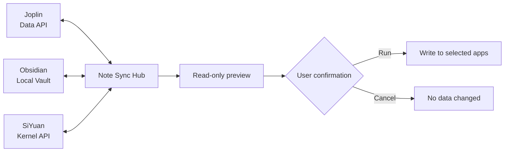

<div align="center">
  
  <h1>Note Sync Hub</h1>
  <p>Safely sync Markdown notes across Joplin, Obsidian, and SiYuan.</p>
  <p><a href="README.md">简体中文</a> · <strong>English</strong></p>
  <p>
    <a href="https://github.com/xing-skyline/note-sync-hub/releases/latest"></a>
    
    
    <a href="LICENSE"></a>
  </p>
  <p>
    <a href="https://github.com/xing-skyline/note-sync-hub/releases/latest"><strong>Download for Windows</strong></a>
  </p>
</div>


## What it is

Note Sync Hub is a local Windows desktop application. Select any two or all three supported note apps, inspect a complete read-only preview, and choose whether to run the sync.

It is useful when you want to:

- Migrate or back up Joplin notes to Obsidian.
- Keep a readable Markdown copy across Obsidian and SiYuan.
- Share Markdown notes, tags, and attachments across Joplin, Obsidian, and SiYuan.
- Review folder mappings, conflicts, and deletion effects before a migration.

The application has no cloud service, account system, or telemetry. Joplin and SiYuan use the API addresses you provide; Obsidian is accessed through the local Vault.

> [!WARNING]
> This is an early release. Back up every participating note library and test with a small set of notes before syncing real data.

> [!NOTE]
> The desktop interface is currently in Chinese. This English README uses translated control names to explain the same workflow.

## Features

| Capability | Details |
| --- | --- |
| Two-app or three-app sync | Enable any two or all three of Joplin, Obsidian, and SiYuan |
| One-way sync | Choose one source and one or two targets |
| Bidirectional sync | Every selected app can create or update notes; a primary app controls deletion direction |
| Read-only preview | Review creates, updates, moves, deletions, links, skips, and conflicts before writing |
| Conflict handling | Merge Markdown block by block; Joplin and Obsidian can also preview a unique latest version |
| Folder mapping | Preserve source folders, write to selected target folders, or write to target roots |
| Tags and attachments | Sync tags and convert Joplin Resources, Obsidian attachments, and SiYuan `assets` links |
| Safer deletion | Deletion propagation is off by default and uses trash or recycle bins when enabled |
| Stale-preview protection | Rescan before execution and stop if notes or attachments changed |
| Cancellation | Stop after the current note finishes |

## How it works



Note Sync Hub adds a synchronization marker to notes so that copies can be matched across applications. Its state files store only the information needed for matching; the application does not create a fourth full note library.

## Quick start

### 1. Download

Open the [latest Release](https://github.com/xing-skyline/note-sync-hub/releases/latest) and download:

```text
NoteSyncHub-v1.2.1-windows-x64.exe
```

The application is a portable single-file EXE. Download `SHA256SUMS.txt` as well if you want to verify the file hash.

The current EXE has no commercial code-signing certificate, so Windows may show an unknown-publisher warning. Download it only from this repository. If you do not want to run unsigned software, use the source instructions below.

See the [Code signing policy](CODE_SIGNING_POLICY.md) for the planned signing
controls, build provenance, privacy, and key management. The current Release
remains unsigned until the project is approved and a new signed version is
actually published.

### 2. Prepare each app

#### Joplin

1. Open Joplin Desktop.
2. Go to **Tools → Options → Web Clipper**.
3. Enable the Web Clipper service and copy its port and Authorization Token.
4. The default address is usually `http://127.0.0.1:41184`.

References: [Joplin Web Clipper](https://joplinapp.org/help/apps/clipper/) · [Joplin Data API](https://joplinapp.org/help/api/references/rest_api/)

#### Obsidian

Select the Vault root folder. No Obsidian plugin is required. The scanner excludes `.obsidian`, `.trash`, `assets`, `attachments`, and the attachment folder configured in Obsidian.

#### SiYuan

1. Start SiYuan Desktop and open the workspace.
2. Open **Settings → About** and copy the API Token.
3. The default local address is `http://127.0.0.1:6806`.

Reference: [SiYuan Kernel API](https://github.com/siyuan-note/siyuan/blob/master/API.md)

### 3. Preview and sync

1. Enable the note apps you want to use and enter the API addresses, Vault, and tokens.
2. Select **Test selected connections**.
3. Select **Refresh folders for selected apps**.
4. Choose one-way or bidirectional sync, scope, target folders, and conflict policy.
5. Select **Generate read-only sync preview**.
6. Review the operation list and resolve red conflict rows.
7. Select **Execute safe operations in preview**.

Generating a preview does not modify notes. The application rescans immediately before execution and stops if any participating note or attachment changed.

## Sync rules

### One-way sync

Choose one source and one or two targets. The destination can use one of three mappings:

| Mapping | Example result |
| --- | --- |
| Preserve source folder structure | `Work/A/Subfolder/Meeting notes` |
| Place under a selected target folder | `Archive/B/A/Subfolder/Meeting notes` |
| Place under the target root | `A/Subfolder/Meeting notes` |

### Bidirectional and three-app sync

Every selected app can create or update notes. The primary app determines deletion propagation and the default conflict reference; it is not a fixed write source.

- If only one app changed, that version propagates to the other selected apps.
- If several apps changed the same note, the application marks a conflict.
- Only Joplin and Obsidian bidirectional sync can select a uniquely latest version by modification time.
- Automatic selection creates a preview and still requires user confirmation.

### Deletion

Deletion propagation from the one-way source or bidirectional primary is off by default.

- Joplin copies go to the Joplin trash.
- Obsidian Markdown files go to the Windows Recycle Bin.
- SiYuan copies move into a single managed Note Sync Hub trash document.
- Attachments are not deleted with a note because another note may still reference them.

In bidirectional mode, deleting a copy from a non-primary app restores it from the primary app instead of propagating the deletion.

## Conflicts and attachments

### Conflicts

Manual conflict handling compares Markdown bodies block by block. Choose the left version, the right version, or keep both changes. The metadata source selected in the merge window determines the title, tags, and folder.

The application will not overwrite automatically when:

- A deletion and an edit happened at the same time.
- An attachment is missing, outside the Vault, or ambiguous.
- A path or synchronization ID has duplicate notes.
- Three apps contain multiple different versions.

### Attachments

During scanning, referenced attachments become internal SHA-256-based references. The target adapter then writes a native link:

- Joplin creates or reuses a Resource.
- Obsidian writes into the Vault attachment folder and creates a relative Markdown link.
- SiYuan uploads into `assets` and creates a SiYuan resource path.

The application reuses attachments with identical content. Normal Obsidian `[[note links]]` are not treated as attachments.

## Data and privacy

Configuration and synchronization state are stored under the current Windows user:

```text
%APPDATA%\NoteSyncHub\
├── config.json
└── state\<endpoint-set-hash>.json
```

- `config.json` contains Joplin and SiYuan tokens in plain text. Do not upload or share it.
- State files contain note IDs, titles, folders, locators, timestamps, and content hashes. They do not contain full note bodies or attachments.
- Runtime logs remain in the current window's memory and are not written to log files. Tokens from the current configuration are redacted.
- The application has no built-in cloud service, login, analytics, or telemetry.
- `.gitignore` excludes `config.json`, build directories, and local caches.

## Current limits

- This is Markdown-level synchronization, not a complete database mirror.
- Obsidian Dataview, Canvas, and plugin-private data are not fully portable.
- Joplin plugin fields are not fully portable.
- SiYuan databases, flashcards, block references, embedded blocks, and other native features may not round-trip.
- App-specific internal note links may remain as text without working in another app.
- There is no scheduled background sync. Each run requires a preview and confirmation.
- Orphaned attachments are not removed automatically.

## Run from source

Requires Windows and Python 3.10 or newer.

```powershell
git clone https://github.com/xing-skyline/note-sync-hub.git
cd note-sync-hub
python -m venv .venv
.\.venv\Scripts\Activate.ps1
python -m pip install -e .
python NoteSyncHub.pyw
```

## Test and build

```powershell
python -m unittest discover -s tests -v
ruff check note_sync_hub tests
python -m pip install -e ".[build]"
.\build_windows.ps1
```

Build output:

```text
dist\NoteSyncHub.exe
```

Project layout:

```text
note_sync_hub/
├── adapters/        # Joplin, Obsidian, and SiYuan adapters
├── attachments.py   # Attachment discovery and internal references
├── diffmerge.py     # Block-level Markdown comparison
├── engine.py        # Matching, planning, conflicts, and safe execution
├── gui.py           # Windows Tkinter interface
├── metadata.py      # Synchronization markers and tag metadata
├── models.py        # Note and operation models
└── state.py         # Local synchronization baseline
```

## FAQ

### Can I sync only two applications?

Yes. Select any two of Joplin, Obsidian, and SiYuan.

### Does it overwrite conflicts automatically?

No by default. Manual review is required. The Joplin–Obsidian latest-version option also produces a preview that you must confirm.

### Can it run as a real-time or background sync service?

No. The current workflow is scan, preview, confirm, and execute.

### Why might antivirus software inspect the EXE?

The EXE is packaged with PyInstaller and is not commercially code-signed. Some security products apply stricter checks to new single-file applications. Verify the SHA-256 from the Release or build from source.

## Contributing

Issues and pull requests are welcome. Changes to synchronization logic should include tests and a description of the participating apps, direction, and reproduction steps.

## Acknowledgements and inspiration

The early Joplin–Obsidian synchronization concept and Joplin integration in Note Sync Hub were inspired by [gorf/joplin-obsidian-bridge](https://github.com/gorf/joplin-obsidian-bridge). Thanks to gorf for openly sharing their work on the Joplin Web Clipper API, synchronization markers, and bidirectional note synchronization.

Note Sync Hub is not a fork of that project. It uses an independently designed multi-adapter architecture, a unified note model, and a preview-before-apply workflow. Compatibility with selected legacy `notebridge_*` synchronization markers is retained to support smooth migration of existing notes.

## License

Note Sync Hub is licensed under the [GNU General Public License v3.0](LICENSE).
